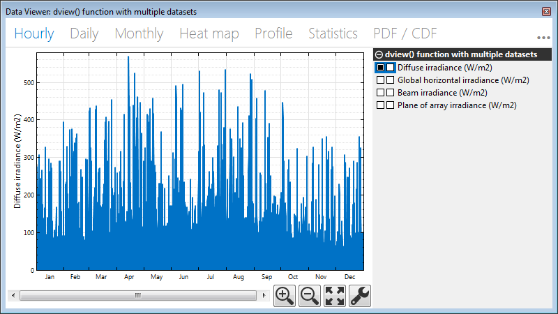
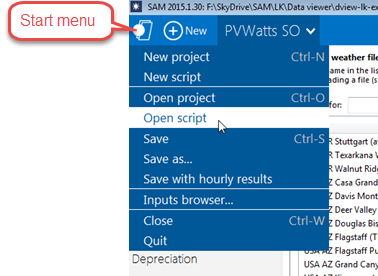
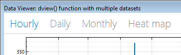
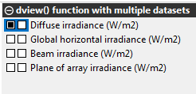

# System Advisor Model LK DView() Function Examples

This document was prepared by Steve Janzou and Paul Gilman, February 4, 2015. It describes three sample LK scripts illustrating the use of the `dview()` function. The function allows you to display time series data in the data viewer used by SAM's user interface. You can use the function to display results from a case in a SAM file, data stored in text files, or values calculated by your script.

## Example 1: dview_from_active_case.lk

Display time series data from the results of a simulation in SAM.
The example displays the `hourly_energy` output variable in the data viewer. It also shows how to use the multiplier parameter of the `dview()` function to convert the hourly energy values from kWh to MWh.

## Example 2: dview_from_text_file_8760_data.lk

Display a single column of time series data stored in a text file (data.txt).

## Example 3: dview_from_csv_file_multiple_8760_data.lk

Display multiple columns of time series data stored in a text file of comma-separated values (data.csv).



This script makes use of the LK `csvread()` function and uses a multidimensional array to display data from the CSV file.
 
## To use the scripts:

1. Open the SAM file dview-lk-example.sam.



2.	From the Start menu, click Open script and open one of the scripts listed above. Note that you can open the script from any SAM file.
 
## Overview of the `dview()` function
 
The `dview()` function opens a new window with a time series data viewer.

For a single column of data, use a single set of data parameters:

```
data_name
data_units
multiplier
data 
```

The script for Example 2 (listed above) displays single column of data. To display data with multiple columns, use one set of data parameters for each column, as in Examples 1 and 3.

<dt>num_datasets</dt>

<dd>The number of data columns to display. For a data set with four columns of data:</dd>

```
num_datasets = 4
```

<dt>timestep</dt>

<dd>The temporal resolution of the time series data in hours. For an hourly data set:</dd>

```
timestep = 1
```

<dt>window name</dt>



<dd>The label to display in the data viewer window's title bar, for example for the window title shown here:</dd>
 
```
window name = "dview() function with multiple datasets"
```

<dt>data_name</dt>

<dd>The label to use for the data set in the legend.</dd>

<dt>data_units</dt>



<dd>The units to display in parentheses after the label. You do not need to include the parentheses in the string.</dd>

<dd>For the first data set in the the example here:</dd>

```
data_name = "Diffuse irradiance" 
data_units = "W/m2"
```

<dt>multiplier</dt>

<dd>The factor to apply to the values in the data set to facilitate unit conversions. To display the values without converting them:</dd>

```
multiplier = 1.0
```

<dt>data1</dt>

<dd>The values in the data set, typically an array of values.</dd>

